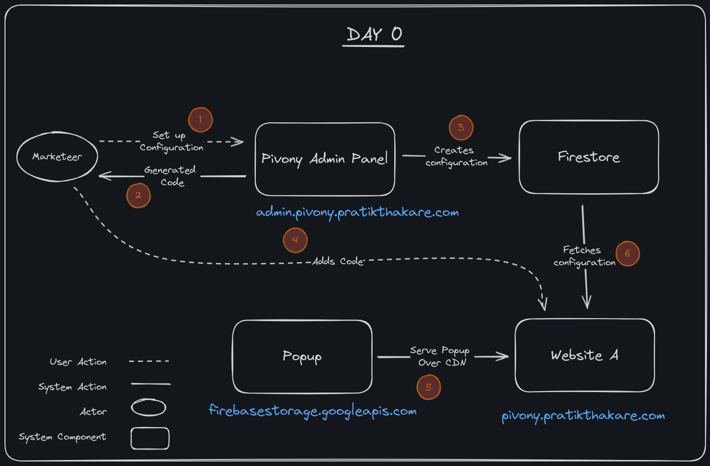
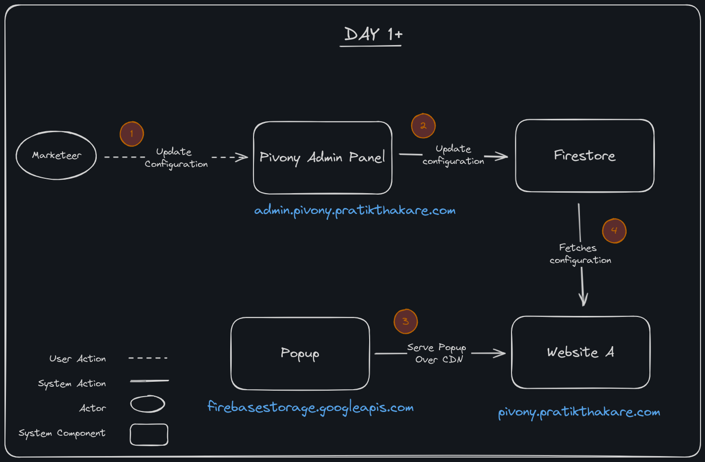
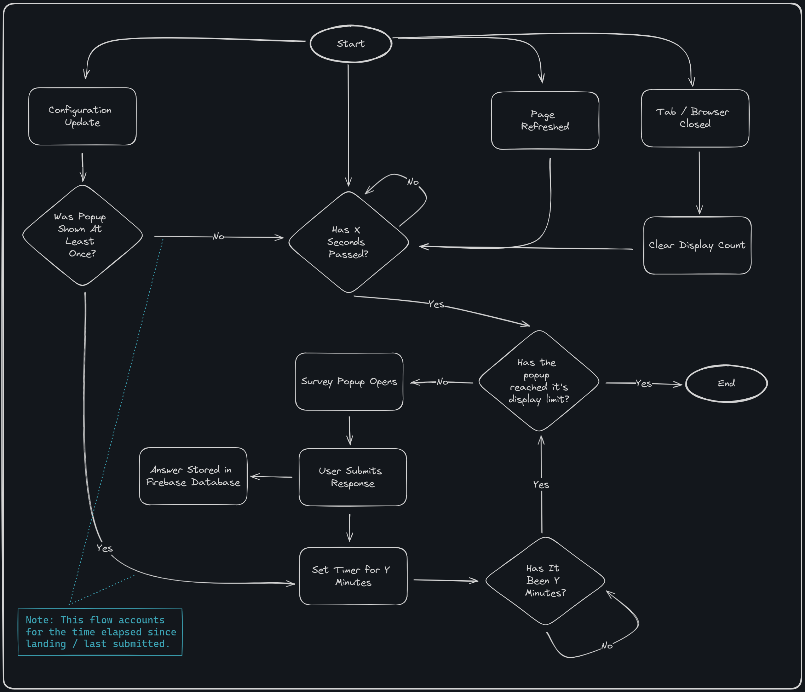

# Pivony

## Overview

This project features an Embedded Survey Popup and an intuitive Admin Panel. Seamlessly configure, manage, and integrate surveys into websites with real-time updates, all in one cohesive package.

### Marketeer Flow

#### Day 0: Initial Setup

On Day 0, we kickstart the project with the foundational setup. The following simple diagram provides a visual representation:



This phase lays the groundwork for a smooth and efficient project journey.

#### Day 1+: Evolving Needs and Configuration

As we progress beyond Day 0, we delve into a dynamic phase marked by evolving requirements. 
During Day 1+, the focus shifts towards continuous configuration to adapt and meet the changing needs of the project.



### User Flow for Embedded Survey Popup

Explore the user flow for the embedded survey popup, showcasing its responsive interactions with specific actions.



## Table of Contents

1. [Project Title](#pivony)
2. [Overview](#overview)
3. [Installation](#installation)
4. [Usage](#usage)
5. [Key Features](#key-features)
6. [Admin Panel](#admin-panel)
7. [Embedded Survey Popup](#embedded-survey-popup)
8. [License](#license)

## Installation

To get started with this project, follow these simple steps:

### Prerequisites

Make sure you have the following tools installed on your machine:

- [Node.js](https://nodejs.org/) - Node.js is required to run the project.
- [pnpm](https://pnpm.io/) - pnpm is the package manager for JavaScript.

### Clone the Repository

```bash
# HTTPS
git clone https://github.com/kryptoblack/pivony.git

# SSH
git clone git@github.com:kryptoblack/pivony.git
```

### Install Dependencies

#### Navigate to Admin Panel

```bash
cd admin_panel
pnpm install
```

#### Navigate to Embedded Survey Popup

```bash
cd popup 
pnpm install
```

### Configure Firebase

#### Create Firebase Resources

1. Create a new Firebase product
2. Configure Storage Bucket
3. Configure Firestore Database
4. Configure Realtime Database
5. Configure Hosting for the Project

#### Build and Upload Embedded Survey Popup 

```bash
cd popup
pnpm run build
```

#### Configure Firebase-Related Settings

1. Update project name in [admin_panel/.firebaserc](admin_panel/.firebaserc)
2. Update project name in github actions' configuration files
3. Configure secret `GITHUB_TOKEN` and `FIREBASE_SERVICE_ACCOUNT` and update them in the pipeline configuration files
4. Upload `.js` and `.css` files from `popup/dist` to Storage Bucket
5. Update URL used in `admin_panel` for code generation with the new URL from your Storage Bucket
6. Update embedded code in [index.html](./index.html) with the same URL

## Usage

### Admin Panel

```bash
# For Development
pnpm run dev

# For Production
pnpm run build
pnpm firebase deploy
```

Note: You can also use the CI/CD Pipeline built using GitHub Actions for deployment.

### Embedded Survey Popup

```bash
# For Development
pnpm run dev

# For Production (You will have to manually deploy the files built and then update the admin_panel and example website)
pnpm run build
```

Note: Make sure you upload the files to the Storage Bucket and updating Admin Panel before deploying the Admin Panel.

### Example Site

Since this is a simple `.html` file we run it over a http server. You can use anything, but I prefer to use python.

```bash
python3 -m http.server 3000
```

## Key Features

1. **Real-time Configuration Updates:**
   - Dynamically adjust popup behavior and content in real-time through the Admin Panel.

2. **Effortless Integration with Code Generation:**
   - Quickly embed the survey popup into marketeer websites using the generated code from the Admin Panel.
   - Generate code once, benefit from real-time updates: No need to repeatedly generate code as configurations evolve.

3. **Survey Answer Storage:**
   - Efficiently capture and store user survey responses for later data-driven analysis.

4. **Efficient Database Management:**
   - Optimize storage for scalability and easy management of collected survey data.

## Admin Panel

The Admin Panel plays a crucial role in configuring the popup settings and generating code snippets for seamless integration on marketeer websites. Here's what the Admin Panel allows you to do:

- **Configure Popup Settings:** Easily customize the behavior and contents of the survey popup. Tailor it to match your marketing requirements.

- **Generate Embed Codes:** The Admin Panel provides a user-friendly interface to generate code snippets. 

These snippets can be effortlessly embedded into marketeer websites, allowing for quick and hassle-free integration of the survey popup.

This central hub empowers administrators with the tools they need to fine-tune the popup's behavior while simplifying the process of generating code for marketing websites.

For more detailed information about the Admin Panel, see the [Admin README](./admin_panel/README.md).

## Embedded Survey Popup

The embedded survey popup seamlessly integrates with the Admin Panel's configurations, ensuring real-time updates based on changes made by administrators. Its primary responsibilities include:

- **Real-time Configuration Adherence:** The popup dynamically adjusts its behavior in real-time, reflecting any modifications made through the Admin Panel. 
This ensures that marketing teams can swiftly implement changes without requiring manual interventions.

- **Survey Answer Storage:** The popup efficiently captures and stores users' survey responses in the database. 
The stored data is centered around survey answers, providing marketers with insights into user preferences, opinions, and feedback.

By seamlessly syncing with the Admin Panel and providing robust data storage capabilities, 
the embedded survey popup serves as a vital component for both real-time configurability and data-driven analysis.

For more detailed information about the Embedded Survey Popup, see the [Embedded Survey Popup README](./popup/README.md).

## License

This project is licensed under the MIT License - see the [LICENSE](LICENSE) file for details.

